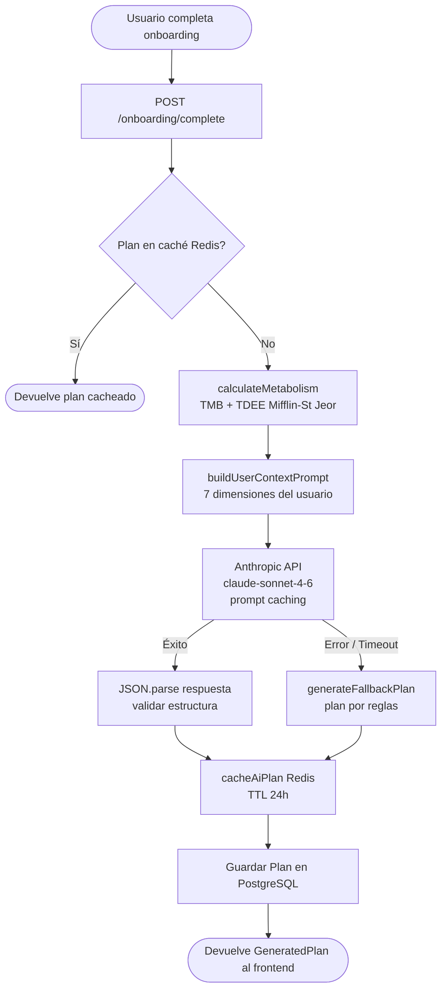

# Arquitectura del módulo IA — Healthy

El módulo de Inteligencia Artificial de Healthy genera planes personalizados de entrenamiento y nutrición usando la API de Anthropic (Claude). Es el componente más sensible en términos de coste y latencia, por lo que incorpora caché Redis, prompt caching y un sistema de fallback por reglas.

---

## Flujo completo de generación



### Descripción paso a paso

| Paso | Módulo | Descripción |
|------|--------|-------------|
| 1 | Backend | El usuario completa el onboarding. El backend llama a `generatePlan(userId, onboardingData)`. |
| 2 | `planGenerator.ts` | Se consulta Redis con clave `plan:{userId}:{YYYY-MM-DD}`. Si existe, se devuelve directamente (sin coste). |
| 3 | `types.ts` | Se calcula TMB y TDEE con `calculateMetabolism()` antes de llamar a Claude. |
| 4 | `planGenerator.ts` | Se construye el prompt de usuario con `buildUserContextPrompt()`: datos de las 7 dimensiones del onboarding + métricas calculadas. |
| 5 | Anthropic SDK | Se llama a `client.messages.create()` con prompt caching en el system prompt. |
| 6 | `planGenerator.ts` | Se extrae el JSON de la respuesta con `extractJson()` (soporta bloques ```json``` y texto plano). |
| 7 | `tokenLogger.ts` | Se registra el uso de tokens y el coste estimado en los logs. |
| 8 | `redis.ts` | Se guarda el plan en Redis con TTL de 24h para evitar regeneraciones innecesarias. |
| 9 | Backend | El plan se persiste en la tabla `plans` de PostgreSQL y se devuelve al frontend. |

---

## Datos de entrada: las 7 dimensiones del onboarding

Todos estos datos se recopilan durante el onboarding del usuario y se agrupan en el objeto `OnboardingData`.

| Dimensión | Interfaz TypeScript | Campos clave | Obligatorio |
|-----------|---------------------|--------------|-------------|
| **1. Perfil físico** | `PhysicalProfile` | `age`, `weight_kg`, `height_cm`, `gender`, `body_type`, `activity_level`, `goal` | Sí |
| **2. Estilo de vida** | `LifestyleData` | `profession`, `stress_level` (1-5), `sleep_hours_usual`, `sleep_quality`, `alcohol_consumption`, `smoker` | No |
| **3. Preferencias de entrenamiento** | `TrainingPreferencesData` | `available_days_per_week`, `has_gym_access`, `home_equipment`, `experience_level`, `injuries_or_limitations` | Sí |
| **4. Preferencias nutricionales** | `NutritionPreferencesData` | `diet_type`, `meals_per_day_preferred`, `food_restrictions[]` | No |
| **5. Condiciones de salud** | `HealthData` | `conditions[].condition_name`, `affects_training`, `affects_nutrition` | No |
| **6. Motivación** | `MotivationData` | `main_motivation`, `previous_attempts`, `tracking_preference` | No |
| **7. Métricas calculadas** | `MetabolismMetrics` | `bmr`, `tdee`, `target_calories` (calculados, no del usuario) | Calculado |

Las lesiones, restricciones alimentarias y condiciones de salud se marcan con `⚠️` en el prompt para que Claude las priorice estrictamente.

---

## Cálculo TMB/TDEE — Mifflin-St Jeor

La función `calculateMetabolism()` en `ai/types.ts` calcula el metabolismo antes de enviar el prompt a Claude. Las calorías resultantes se incluyen en el prompt como dato calculado de referencia.

### Fórmula Mifflin-St Jeor

```
Hombre:  TMB = 10 × peso(kg) + 6.25 × altura(cm) − 5 × edad(años) + 5
Mujer:   TMB = 10 × peso(kg) + 6.25 × altura(cm) − 5 × edad(años) − 161
```

### Factor de actividad (TDEE = TMB × factor)

| Nivel de actividad | Factor | Descripción |
|--------------------|--------|-------------|
| `sedentary` | 1.20 | Trabajo de escritorio, sin ejercicio |
| `light` | 1.375 | Ejercicio ligero 1-3 días/semana |
| `moderate` | 1.55 | Ejercicio moderado 3-5 días/semana |
| `active` | 1.725 | Ejercicio intenso 6-7 días/semana |
| `very_active` | 1.90 | Ejercicio muy intenso + trabajo físico |

### Calorías objetivo según goal

| Objetivo (`UserGoal`) | Cálculo | Mínimo |
|----------------------|---------|--------|
| `lose_weight` | TDEE × 0.80 | 1200 kcal |
| `gain_muscle` | TDEE × 1.10 | — |
| `maintain` | TDEE | — |
| `general_health` | TDEE | — |

### Ejemplo práctico

```
Hombre, 30 años, 80 kg, 180 cm, actividad moderada, objetivo: perder peso

TMB  = 10×80 + 6.25×180 − 5×30 + 5 = 800 + 1125 − 150 + 5 = 1780 kcal
TDEE = 1780 × 1.55 = 2759 kcal
Target = 2759 × 0.80 = 2207 kcal
```

---

## Estructura del JSON de salida (`GeneratedPlan`)

Claude devuelve un JSON que el sistema parsea y enriquece con campos calculados antes de guardarlo.

```typescript
interface GeneratedPlan {
  training_plan: {
    weeks: number;                   // Normalmente 4
    sessions_per_week: number;       // Días activos por semana
    weekly_schedule: WeeklySession[]; // 7 entradas (uno por día)
  };
  nutrition_plan: {
    daily_calories: number;          // Basado en target_calories del TDEE
    macros: {
      protein_g: number;
      carbs_g: number;
      fat_g: number;
    };
    meals_per_day: number;
    meal_suggestions: MealSuggestion[]; // Al menos una por tipo de comida
  };
  notes: string;                     // Recomendaciones generales
  generated_at: string;              // ISO 8601
  model_version: string;             // "claude-sonnet-4-6"
  generated_by_ai: boolean;          // false si es plan de fallback
  metabolism_metrics: MetabolismMetrics; // TMB, TDEE, target_calories
}
```

### Sesión de entrenamiento (`WeeklySession`)

```typescript
interface WeeklySession {
  day_of_week: number;              // 1 (lunes) … 7 (domingo)
  day_name: string;                 // "Lunes", "Martes", etc.
  session_type: 'strength' | 'cardio' | 'hiit' | 'flexibility' | 'rest';
  duration_minutes: number;         // 0 si es día de descanso
  muscle_groups: string[];          // ["pecho", "tríceps"]
  exercises: ExerciseDetail[];
  notes?: string;
}
```

### Sugerencia de comida (`MealSuggestion`)

```typescript
interface MealSuggestion {
  meal_type: 'breakfast' | 'lunch' | 'dinner' | 'snack';
  name: string;
  description: string;
  approximate_calories: number;
  protein_g: number;
  carbs_g: number;
  fat_g: number;
  ingredients: string[];
  prep_time_minutes?: number;
}
```

---

## Prompt caching

El módulo implementa prompt caching de Anthropic para reducir el coste de tokens en llamadas repetidas.

### Qué se cachea

El **system prompt base** (`SYSTEM_PROMPT` en `planGenerator.ts`) se marca con `cache_control: { type: 'ephemeral' }`:

```typescript
{
  type: 'text',
  text: SYSTEM_PROMPT,           // ~1000 tokens de instrucciones fijas
  cache_control: { type: 'ephemeral' },
}
```

Este bloque contiene las instrucciones de rol, el JSON schema de respuesta y los criterios de calidad. No cambia entre usuarios.

### Qué NO se cachea

El **bloque de contexto del usuario** (`buildUserContextPrompt()`) varía por usuario y no se cachea. Contiene los datos de onboarding, las métricas calculadas y el contexto de regeneración.

### Cuándo se produce el ahorro

- **Primera llamada del día**: Claude escribe el system prompt al caché (`cache_creation_input_tokens`). Coste normal de input.
- **Llamadas siguientes**: Claude lee el system prompt del caché (`cache_read_input_tokens`). Coste 10x menor ($0.30/MTok vs $3.00/MTok).

### Ahorro estimado

El system prompt tiene aproximadamente 1000 tokens. En llamadas con cache hit:

```
Sin caché:  1000 tokens × $3.00/MTok  = $0.003000
Con caché:  1000 tokens × $0.30/MTok  = $0.000300
Ahorro:     ~$0.002700 por llamada (~90% en el system prompt)
```

En generaciones donde el contexto del usuario representa ~500 tokens adicionales, el ahorro global es aproximadamente **80%** de los tokens de input facturados.

### Precios completos (claude-sonnet-4-6)

| Tipo de token | Precio por millón |
|---------------|-------------------|
| Input (no cacheado) | $3.00/MTok |
| Output | $15.00/MTok |
| Cache read | $0.30/MTok |
| Cache write | $3.75/MTok |

---

## Sistema de fallback

### Cuándo se activa

El plan de fallback (`fallbackPlan.ts`) se activa automáticamente cuando:
- La API de Anthropic devuelve un error (red, timeout, rate limit, 5xx)
- El JSON devuelto por Claude no es parseable
- El contenido de la respuesta no es de tipo texto

### Qué devuelve

El fallback genera un plan estructurado basado en reglas predefinidas:

1. Usa `calculateMetabolism()` para calcular las calorías (mismo cálculo que con Claude).
2. Selecciona tipos de sesión según el objetivo (`lose_weight` → más cardio e HIIT; `gain_muscle` → más fuerza).
3. Selecciona ejercicios de plantillas básicas según acceso a gimnasio.
4. Usa plantillas de comidas por tipo de dieta (omnívoro, vegetariano, vegano).
5. Calcula macros según ratios estándar basados en evidencia.

El campo `generated_by_ai: false` indica al frontend que el plan es de fallback. La app puede mostrar un aviso al usuario y permitirle solicitar un plan IA cuando el servicio esté disponible.

---

## Regeneración automática por estancamiento

### Criterio de estancamiento (`shouldRegeneratePlan`)

La función analiza los registros de progreso del usuario y detecta estancamiento cuando se cumplen **todas** estas condiciones:

- Hay al menos **4 registros de peso** en los últimos **14 días**
- La variación de peso máxima entre esos registros es **≤ 0.5 kg**

```
Ejemplo:
  Lunes    82.3 kg
  Miércoles 82.1 kg
  Viernes   82.4 kg
  Lunes     82.2 kg
  Variación: 82.4 − 82.1 = 0.3 kg → ESTANCAMIENTO DETECTADO
```

### Regeneración (`regeneratePlan`)

Cuando se detecta estancamiento (o el usuario cambia de objetivo, reporta una lesión, o pide manualmente una actualización), se llama a `regeneratePlan()`. Esta función:

1. Construye un contexto adicional según la razón (`buildRegenerationContext()`).
2. Para estancamiento de peso: instruye a Claude a ajustar ±100-150 kcal, introducir variación en tipos de entrenamiento y considerar ciclar carbohidratos.
3. Incluye los datos reales de peso reciente en el contexto.
4. Llama a `generatePlan()` con `requestType: 'plan_regeneration'` (no consulta el caché Redis para asegurar un plan nuevo).

### Razones de regeneración (`RegenerationReason`)

| Razón | Trigger | Acción de Claude |
|-------|---------|-----------------|
| `weight_plateau` | Auto / >2 sem sin cambio ±0.5 kg | Ajustar calorías ±100-150 kcal, variar tipos de entrenamiento |
| `goal_change` | Usuario cambia su objetivo | Plan completamente nuevo para el nuevo objetivo |
| `injury` | Usuario reporta lesión | Adaptar entrenamiento respetando la limitación |
| `manual_request` | Usuario pide actualización | Plan variado para mantener motivación |

---

## Costes estimados por usuario/mes

Supuestos:
- 1 generación de plan por semana (4/mes)
- Sistema prompt: ~1000 tokens (cacheado en llamadas 2-4)
- Contexto usuario: ~500 tokens por llamada
- Respuesta de Claude: ~2000 tokens de output

| Llamada | Input tokens | Cache read | Output tokens | Coste estimado |
|---------|-------------|-----------|---------------|----------------|
| 1ª del mes (cache write) | 500 + 1000 | 0 | 2000 | ~$0.0335 |
| 2ª–4ª del mes (cache hit) | 500 | 1000 | 2000 | ~$0.0318 |
| **Total 4 generaciones** | | | | **~$0.129** |

Con el caché de Anthropic activo, el coste por usuario/mes para generaciones semanales es de aproximadamente **$0.13 USD**.

Sin prompt caching (comparación):

| Llamada | Coste sin caché |
|---------|----------------|
| 4 × sin caché | ~$0.144 |
| **Ahorro mensual** | **~$0.015 (~10%)** |

> Nota: el ahorro de prompt caching es más significativo cuando hay muchas llamadas en la misma ventana de 5 minutos (por ejemplo, durante el onboarding de muchos usuarios en paralelo). En uso normal por usuario el ahorro es modesto, pero en escala (10K usuarios) supone ~$150/mes.

---

## Ficheros del módulo IA

| Archivo | Responsabilidad |
|---------|----------------|
| `ai/types.ts` | Interfaces TypeScript, enums, `calculateMetabolism()`, JSON schema |
| `ai/planGenerator.ts` | `generatePlan()`, `shouldRegeneratePlan()`, `regeneratePlan()` |
| `ai/fallbackPlan.ts` | Plan generado por reglas cuando Claude no está disponible |
| `ai/tokenLogger.ts` | Log de tokens y estimación de costes USD |
| `database/redis.ts` | `cacheAiPlan()`, `getCachedAiPlan()` — caché de planes |
