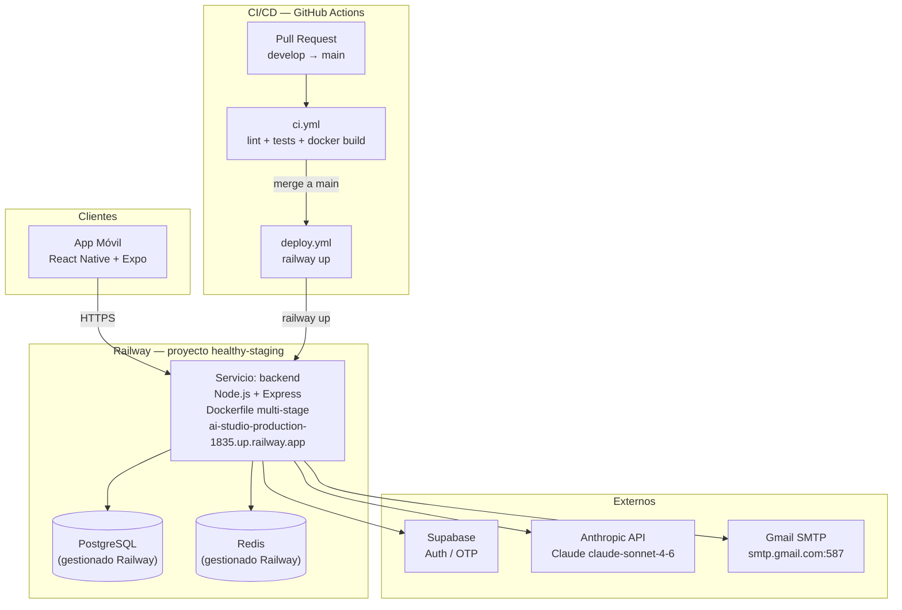

# Arquitectura Web — Healthy

Healthy despliega su backend en Railway (proyecto `healthy-staging`), con PostgreSQL y Redis gestionados por el mismo proveedor. La landing estática se sirve vía S3 + CloudFront (ver [landing-deploy.md](./landing-deploy.md)). AWS **no se usa** para el backend.

---

## Diagrama de arquitectura



---

## Diagrama ASCII

```
┌──────────────────────────────────────────────────────────────────────┐
│                            INTERNET                                  │
└──────────────────────────────────┬───────────────────────────────────┘
                                   │ HTTPS
                                   ▼
                    ┌──────────────────────────────┐
                    │  Railway — backend           │
                    │  Node.js + Express + Prisma  │
                    │  (Dockerfile, root: backend/)│
                    │  ai-studio-production-       │
                    │  1835.up.railway.app         │
                    └───────────┬──────────────────┘
                                │
                   ┌────────────┴────────────┐
                   ▼                         ▼
          ┌─────────────────┐      ┌─────────────────┐
          │  PostgreSQL      │      │  Redis          │
          │  (Railway        │      │  (Railway       │
          │  managed)        │      │  managed)       │
          └─────────────────┘      └─────────────────┘

──────── SERVICIOS EXTERNOS ───────────────────────────────────────────

  Backend ──────→  Supabase        (Auth / OTP emails)
  Backend ──────→  Anthropic API   (Claude claude-sonnet-4-6)
  Backend ──────→  Gmail SMTP      (smtp.gmail.com:587)

──────── CI / CD ──────────────────────────────────────────────────────

  GitHub                         GitHub
  push develop                   push main
       │                              │
       ▼                              ▼
  deploy.yml                    deploy.yml
  railway up                    railway up
  → staging                     → producción
  backend-staging-              ai-studio-production-
  01ee.up.railway.app           1835.up.railway.app

  (En PRs: ci.yml — lint + tests + docker build, sin deploy)
```

---

## Componentes

| Componente | Proveedor | Descripción |
|---|---|---|
| **Backend `backend`** | Railway | Servicio Node.js + Express + Prisma. Builder Dockerfile multi-stage. Root: `projects/healthy/backend`. Dominio `ai-studio-production-1835.up.railway.app`. Service ID staging: `fa137c98-5210-4057-a531-f1c7fbf39743`. |
| **PostgreSQL** | Railway (managed) | Base de datos principal. Referenciada como `${{Postgres.DATABASE_URL}}`. Backups automáticos incluidos en el plan Railway. |
| **Redis** | Railway (managed) | Caché de planes IA (TTL 24 h) y store de refresh tokens. Referenciado como `${{Redis.REDIS_URL}}`. |
| **Supabase** | External (EU) | Autenticación de usuarios: registro, verificación OTP por email, tokens JWT. Gestiona el proveedor de emails transaccionales. |
| **Anthropic API** | External | Generación de planes personalizados con `claude-sonnet-4-6`. Prompt caching activado (`cache_control`) para el system prompt base (~80 % reducción de tokens facturados). |
| **Gmail SMTP** | External | Envío de emails de verificación y recuperación de contraseña. Host: `smtp.gmail.com:587`. Usuario: `trutool@gmail.com`. **SMTP no está configurado en staging** — los emails se loguean en consola. Pendiente configurar para producción. |
| **Landing (S3 + CloudFront)** | AWS | Landing estática independiente del backend. Ver [landing-deploy.md](./landing-deploy.md). |

---

## Estructura del repositorio

```
ai-studio/                              ← raíz del repositorio
├── .github/workflows/
│   ├── deploy.yml                      → deploy backend a Railway (staging/prod)
│   ├── ci.yml                          → lint + tests en PRs
│   └── tests.yml                       → suite de tests con cobertura
├── agents/                             → definiciones de agentes reutilizables
└── projects/healthy/
    ├── backend/                        → API Node.js — raíz del servicio Railway
    │   ├── Dockerfile                  → build multi-stage (builder + runner)
    │   ├── railway.toml                → config Railway (healthcheck, builder)
    │   └── prisma.config.ts            → config Prisma 7 (datasource URL para migraciones)
    ├── frontend/                       → App React Native + Expo
    ├── database/                       → Schema Prisma, migraciones, seed
    ├── devops/                         → Workflows EAS, docs infra, estrategia backup
    │   └── .github/workflows/          → workflows adicionales (EAS, landing, backup)
    ├── docs/                           → Documentación técnica (este directorio)
    ├── landing/                        → Landing estática (S3 + CloudFront)
    ├── security/                       → Auditoría RGPD y seguridad
    └── tests/                          → Tests de carga y E2E
```

---

## Modelo de contenedor Docker

El backend se construye con un **Dockerfile multi-stage** para minimizar el tamaño de la imagen final.

### Etapa 1 — builder
- Instala todas las dependencias (incluidas devDependencies para disponer del CLI de Prisma)
- Ejecuta `npx prisma generate` → genera el cliente JavaScript en `src/generated/prisma/`

### Etapa 2 — runner
- Instala solo dependencias de producción (`npm ci --omit=dev`)
- Copia el cliente Prisma generado desde la etapa builder
- Copia el código fuente

### Arranque del contenedor (CMD)

```
npx prisma migrate deploy || echo '[WARN] migrate fallo' && node server.js
```

Las migraciones se ejecutan al arrancar. Si fallan (e.g. primer deploy sin DB), el servidor arranca igualmente y el healthcheck reporta `db: error`.

### Prisma 7 — driver adapter

Prisma 7 no acepta `url` en el datasource del schema. La URL de conexión:
- **Para migraciones:** `prisma.config.ts` provee `process.env.DATABASE_URL`
- **Para PrismaClient:** se pasa un adapter explícito `PrismaPg(new Pool({ connectionString: DATABASE_URL }))`

---

## Entornos Railway

| Entorno | Servicio | Dominio | Rama |
|---------|---------|---------|------|
| Producción | `ai-studio` (ID: `ec2720da-...`) | `ai-studio-production-1835.up.railway.app` | `main` |
| Staging | `backend` (ID: `fa137c98-...`) | `backend-staging-01ee.up.railway.app` | `develop` |

Proyecto Railway: `healthy-staging` (ID: `a01d9f3d-510b-4529-b75a-d9d7198cbcb5`)

---

## Flujo CI/CD

### Backend (push a `develop` o `main`)

```
1. Push a develop o main
2. GitHub Actions dispara deploy.yml:
   a. test   → npm test --coverage (cobertura ≥ 80 %)
   b. deploy → railway up (ejecutado desde la raíz del repositorio)
              NOTA: el CLI sube el repositorio completo y Railway navega
              a projects/healthy/backend según la configuración del servicio.
   c. smoke  → GET /health con 3 reintentos
```

### En Pull Requests (ci.yml)

```
1. Apertura / actualización de PR
2. GitHub Actions dispara ci.yml:
   a. lint        → ESLint
   b. tests       → Jest con cobertura ≥ 80 % (tests.yml)
   c. docker build → verifica que la imagen compila (sin push ni deploy)
```

### Landing (push a `main` con cambios en `landing/`)

Ver [landing-deploy.md](./landing-deploy.md).

### Secretos necesarios en GitHub

| Secret | Uso |
|--------|-----|
| `RAILWAY_TOKEN` | Autenticación Railway CLI en CI (`railway up`) |
| `JWT_SECRET` | Clave de access tokens |
| `JWT_REFRESH_SECRET` | Clave de refresh tokens |
| `SUPABASE_URL` | URL Supabase del entorno |
| `SUPABASE_KEY` | Clave anon Supabase (`process.env.SUPABASE_KEY` en el backend) |
| `SUPABASE_SERVICE_ROLE_KEY` | Clave de servicio Supabase (operaciones privilegiadas) |
| `SMTP_USER` | `trutool@gmail.com` |
| `SMTP_PASS` | Contraseña de aplicación Gmail |
| `ANTHROPIC_API_KEY` | API key de Anthropic |
| `AWS_ACCESS_KEY_ID` | Solo para deploy de la landing |
| `AWS_SECRET_ACCESS_KEY` | Solo para deploy de la landing |
| `CLOUDFRONT_DISTRIBUTION_ID` | Solo para invalidación de caché de la landing |

---

## Estimación de costes mensuales

> Estimación para tráfico bajo (early stage). Precios aproximados Railway, junio 2026.

| Servicio | Tier / Uso | Coste estimado |
|---|---|---|
| Railway backend `ai-studio` | Hobby/Pro, uso bajo | ~$5–10/mes |
| Railway PostgreSQL | Managed, early stage | ~$5–10/mes |
| Railway Redis | Managed, early stage | ~$3–5/mes |
| Supabase | Free tier (hasta 50k MAU) | $0/mes |
| Anthropic API | Variable según uso | ~$5–20/mes |
| Gmail SMTP | Gratuito (límite 500 emails/día) | $0/mes |
| S3 + CloudFront (landing) | Tráfico bajo | ~$1–5/mes |
| **Total estimado** | | **~$19–50/mes** |

El mayor salto de coste vendrá al escalar el plan Railway (más RAM/CPU) o superar el free tier de Supabase. Significativamente más económico que la arquitectura AWS anterior (~$56–80/mes).

---

> Última actualización: 2026-07-07 — Docs Agent (actualización post-deploy: Dockerfile, monorepo, Prisma 7, variables)
